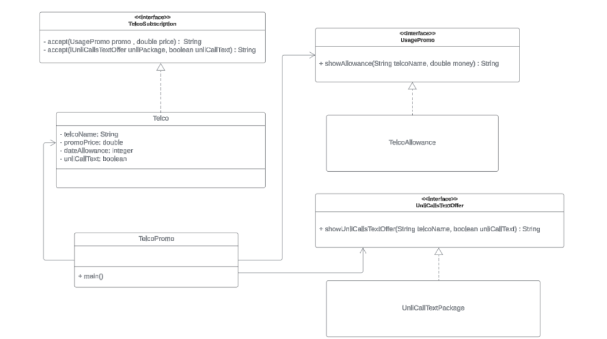

# 📱 Telco Promo – Visitor Design Pattern in Java

A Java implementation of the **Visitor Design Pattern** applied to a telecommunications promo comparison system. This project models three major telco providers (Smart, Globe, and Ditto) and uses visitors to display their data allowance offers and unlimited call/text packages.

---

## 📐 Design Pattern Used

### Visitor Pattern
The **Visitor Pattern** allows you to add new operations to existing class hierarchies without modifying them. Instead of embedding display logic inside `Telco`, separate *visitor* classes (`TelcoAllowance`, `UnliCallTextPackage`) each "visit" the telco data and produce their own output.

| Role | Class / Interface |
|---|---|
| Element Interface | `TelcoSubscription` |
| Concrete Element | `Telco` |
| Visitor Interface (Data) | `UsagePromo` |
| Visitor Interface (Calls) | `UnliCallsTextOffer` |
| Concrete Visitor (Data) | `TelcoAllowance` |
| Concrete Visitor (Calls) | `UnliCallTextPackage` |
| Client | `TelcoPromo` |

## Class Diagram

